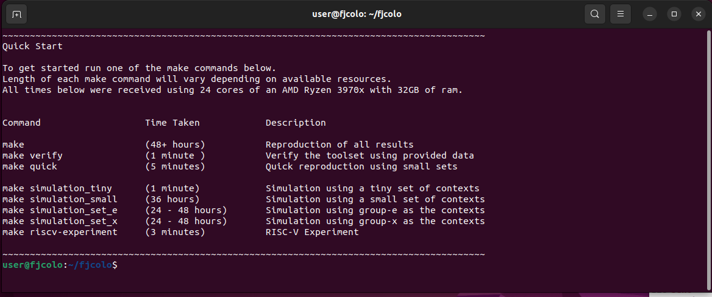
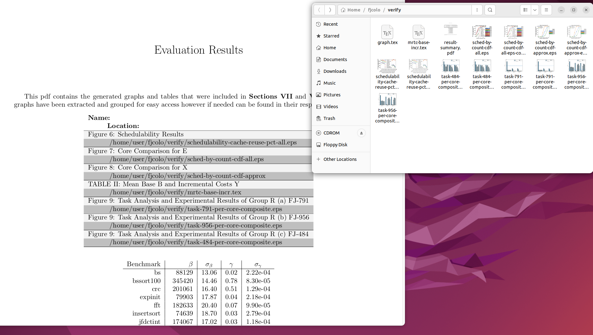
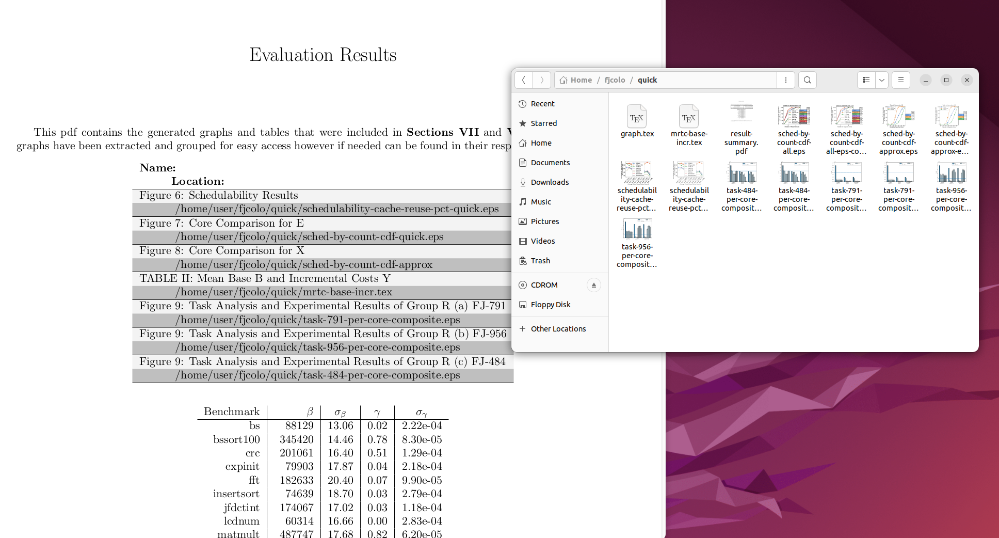
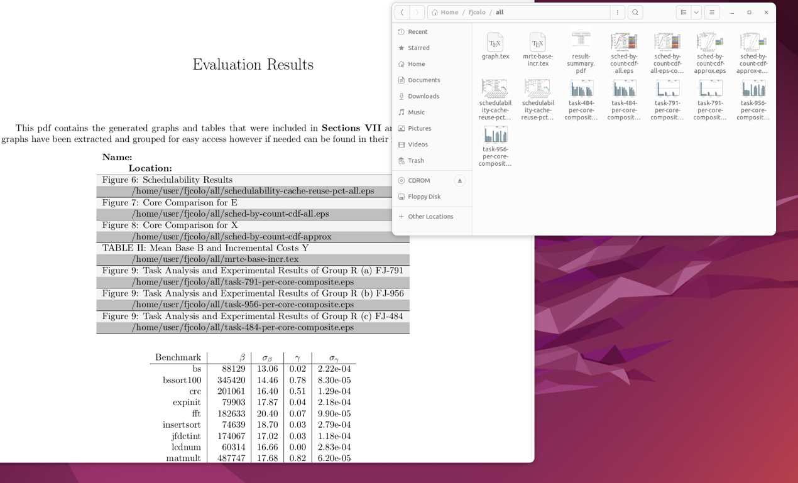

# Reproduction of Results for Co-Located Parallel Scheduling of Threads to Optimize Cache Sharing


This document contains the instructions for reproducing the results of: **Co-Located Parallel Scheduling of Threads to Optimize Cache Sharing**. Within the work, the results are distributed across sections VII and VIII. The first, Section VII, simulates tasks for the comparison of the approximation methods. The second, Section VIII verifies the performance of the approximation methods on a QEMU virtualized RISC-V system. The principal results are figures and tables. The principal results are enumerated by their section below:

**Section VII**  
   1. Figure 6: Schedulability Results  
   2. Figure 7: Core Comparison for E 
   3. Figure 8: Core Comparison for X  

**Section VIII**  

   4. Table II: MRTC Mean Base β and Incremental Costs Y  
   5. Figure 9.a: FJ-791 F=.95
   6. Figure 9.b: FJ-956 F=.18
   7. Figure 9.c: FJ-484 F=.55

      
A virtual machine has been provided to reproduce the results. The first step in reproduction is to obtain and verify the virtual machine image. Reproduction of the synthetic results is a computationally intensive process with an expected run-time between 12 and 48 hours depending on the users hardware. As a costly operation, the reproduction toolset and results have been divided into increasingly time intensive and complex sets. The following sections guide the reader through the reproduction process.

Section 1 provides the instructions for obtaining, installing, and verifying the virtual machine image. The data used to produce the figures and tables within the work are included within the virtual machine image. Section 2 provides the instructions for reproducing the figures and tables from this data and also serves to verify the toolset for generating the results are operating correctly. Section 3 provides instructions for producing a smaller set of tasks and is given the shorthand name of "Quick". Section 4 provides instructions for performing a "Complete" reproduction matching the task set generation parameters from the work.


# Section 1 - Obtaining, Installing, and Verifying the OVA


The virtual machine is provided as an Open Virtual Appliance (OVA) suitable for use with VirtualBox. The virtual machine image is approximately 40 gigabytes, named `fjcolo.ova`, and is available from:

```
http://tessler.cs.unlv.edu/arx/oc/fjcolo.ova
```
Upon downloading, the correctness of the image may be validated by verifying its checksum.
The checksum can be verified on a Linux system with: 
```
$ md5sum fjcolo.ova 
aca586a7a7a24e83c2a1102b257dab87  fjcolo.ova
```

| MD5 Checksum| File   |
| ----------- | ----------- |
|aca586a7a7a24e83c2a1102b257dab87 | fjcolo.ova |

The provided virtual machine image was created using VirtualBox and is the recommended virtualization platform for its use. VirtualBox is available for download from:

```
https://www.virtualbox.org/wiki/Downloads
```

Readers are expected to install VirtualBox and install the virtual machine within it indepedently. Additionally, the "Complete" reproduction requires undisturbed execution for a 48 hour period (potentially longer depending on the user's hardware).

When creating the virtual machine using the `fjcolo.ova` image, the required machine parameters are:

 - Hard disk - At least 40 GB of disk space is required. 
 - CPU - At least 24 cores
 - RAM - 32768 MB.


After successfully importing and booting the OVA, the system is set to automatically login. If the system does not automatically login or is logged out, it can be logged back in with the following user information:

~~~
username: fjcolo
password: password
~~~


After logging in, the desktop environment will spawn a terminal with a brief set of instructions:



The default terminal will be in the `/home/user/fjcolo` directory. In addition to this, the terminal will include quick start instructions with several `make` targets for reproduction. 

`fjcolo.ova` contains the necessary tools, utilities, and clone of the public evaluation repository used in the work. As a stand alone image, `fjcolo.ova`, may be used to reproduce results similar to those in the
work; given the random nature of task creation the results may not exactly match those found in the published work.

Those interested in reproducing the results from the evaluation repository or modifying the methodology may clone the repository from:

```
https://github.com/ctessler/fork-join-colo/releases/tag/v2.1
```


# Section 2 - Reproduction with Provided Data

The `verify` target produces the figures and tables from data provided from the work. The `verify` target ensures that the toolset is working by using the provided data to quickly produce the figures from Section VII of the work. Additionally, the `verify` target will run the approximation methods on a QEMU virtualized RISC-V system producing figures from Section VIII of the work. 

Reproducing the figures from the work has an estimated run time of 1 minute using 24 cores of an AMD Ryzen 3970x with 32GB of ram. Running the `verify` target requires an undisturbed execution for a 1 minute period (potentially longer depending on the user's hardware). A production of figures from the work with the provided data can be started with: 

```
make verify
```

<br> 

The table below includes a list of all results produced, and where they can be found in the environment after completing the instructions. 

<br> 
<br> 
<br> 
<br> 

| **Name:** <br>    &nbsp;&nbsp;&nbsp;&nbsp; **Location:**        | 
| :-|
|     `Figure 6:` Schedulability Results <br>    
&nbsp;&nbsp;&nbsp;&nbsp; /home/user/fjcolo/verify/schedulability-cache-reuse-pct-all.eps    |
|     `Figure 7:` Core Comparison for E <br>    
&nbsp;&nbsp;&nbsp;&nbsp; /home/user/fjcolo/verify/sched-by-count-cdf-all.eps     |
|     `Figure 8:` Core Comparison for X  <br>    
&nbsp;&nbsp;&nbsp;&nbsp; /home/user/fjcolo/verify/sched-by-count-cdf-approx    |
|     `TABLE II:` MRTC Mean Base β and Incremental Costs Y  <br>    
&nbsp;&nbsp;&nbsp;&nbsp; /home/user/fjcolo/verify/mrtc-base-incr.tex     |
|     `Figure 9:` Task Analysis and Experimental Results of Group R - `(a)` FJ-791 F = .95 <br>    
&nbsp;&nbsp;&nbsp;&nbsp; /home/user/fjcolo/verify/task-791-per-core-composite.ep    |
|     `Figure 9:` Task Analysis and Experimental Results of Group R - `(b)` FJ-956 F = .18 <br>    
&nbsp;&nbsp;&nbsp;&nbsp; /home/user/fjcolo/verify/task-956-per-core-composite.eps   |
|     `Figure 9:` Task Analysis and Experimental Results of Group R - `(c)` FJ-484 F = .55 <br>    
&nbsp;&nbsp;&nbsp;&nbsp; /home/user/fjcolo/verify/task-484-per-core-composite.eps   |


Additionally, the resulting figures and tables are available as a single PDF named `result-summary.pdf`. The single pdf can be found within the `/home/user/fjcolo/verify` directory. An example of this pdf is found below: 




# Section 3 - Quick Reproduction

The `quick` target produces results using a smaller set of tasks. The smaller set of tasks is used to reproduce results and figures from Section VII of the work. In addition to this the `quick` target will run the approximation methods on a QEMU virtualized RISC-V system, found in Section VIII of the work. By virtue of using a smaller, less complex data set the figures and tables produced by the quick target will not correspond to those found in the work. This target verifies the toolset will produce figures and data from generated data, rather than provided data (as in Section 2).

A quick reproduction has an estimated run time of 5 minutes using 24 cores of an AMD Ryzen 3970x with 32GB of ram. Running the `quick` target requires an undisturbed execution for a 5 minute period (potentially longer depending on the user's hardware). A quick reproduction can be started with:  


```
make quick
```


The table below includes a list of all results produced, and where they can be found in the environment after completing the instructions.  


| **Name:** <br>    &nbsp;&nbsp;&nbsp;&nbsp; **Location:**        | 
| :-|
|     `Figure 6:` Schedulability Results <br>    
&nbsp;&nbsp;&nbsp;&nbsp; /home/user/fjcolo/quick/schedulability-cache-reuse-pct-all.eps    |
|     `Figure 7:` Core Comparison for E <br>    
&nbsp;&nbsp;&nbsp;&nbsp; /home/user/fjcolo/quick/sched-by-count-cdf-all.eps     |
|     `Figure 8:` Core Comparison for X  <br>    
&nbsp;&nbsp;&nbsp;&nbsp; /home/user/fjcolo/quick/sched-by-count-cdf-approx    |
|     `TABLE II:` MRTC Mean Base β and Incremental Costs Y  <br>    
&nbsp;&nbsp;&nbsp;&nbsp; /home/user/fjcolo/quick/mrtc-base-incr.tex     |
|     `Figure 9:` Task Analysis and Experimental Results of Group R - `(a)` FJ-791 F = .95 <br>    
&nbsp;&nbsp;&nbsp;&nbsp; /home/user/fjcolo/quick/task-791-per-core-composite.ep    |
|     `Figure 9:` Task Analysis and Experimental Results of Group R - `(b)` FJ-956 F = .18 <br>    
&nbsp;&nbsp;&nbsp;&nbsp; /home/user/fjcolo/quick/task-956-per-core-composite.eps   |
|     `Figure 9:` Task Analysis and Experimental Results of Group R - `(c)` FJ-484 F = .55 <br>    
&nbsp;&nbsp;&nbsp;&nbsp; /home/user/fjcolo/quick/task-484-per-core-composite.eps   |


Additionally, the resulting figures and tables are available as a single PDF named `result-summary.pdf`. The single pdf can be found within the `/home/user/fjcolo/quick` directory. An example of this pdf is found below: 




<br> 

# Section 4 - Complete Reproduction


The `all` target reproduces results matching the task set generation parameters from the work. The task set generation parameters are used to reproduce results and figures from Section VII of the work. In addition to this the `all` target will run the approximation methods on a QEMU virtualized RISC-V system. This will reproduce the figures from Section VIII of the work. The results produced by the all (aka "Complete") target will use the same task set generation parameters as those found in the work. However, the evaluation process includes pseudo-randomly generated values; as such the figures and tables may not exactly match those found in the work.  

The complete reproduction had an expected run time of 48 hours using 24 cores of an AMD Ryzen 3970x with 32GB of ram. Running the `all` target requires an undisturbed execution for a 48 hour period (potentially longer depending on the user's hardware). A complete reproduction can be started with:  

```
make all
```

The table below includes a list of all results produced, and where they can be found in the environment after completing the instructions. 

| **Name:** <br>    &nbsp;&nbsp;&nbsp;&nbsp; **Location:**        | 
| :-|
|     `Figure 6:` Schedulability Results <br>    
&nbsp;&nbsp;&nbsp;&nbsp; /home/user/fjcolo/all/schedulability-cache-reuse-pct-all.eps    |
|     `Figure 7:` Core Comparison for E <br>    
&nbsp;&nbsp;&nbsp;&nbsp; /home/user/fjcolo/all/sched-by-count-cdf-all.eps     |

<br>

| **Name:** <br>    &nbsp;&nbsp;&nbsp;&nbsp; **Location:**        | 
| :-|
|     `Figure 8:` Core Comparison for X  <br>    
&nbsp;&nbsp;&nbsp;&nbsp; /home/user/fjcolo/all/sched-by-count-cdf-approx    |
|     `TABLE II:` MRTC Mean Base β and Incremental Costs Y  <br>    
&nbsp;&nbsp;&nbsp;&nbsp; /home/user/fjcolo/all/mrtc-base-incr.tex     |
|     `Figure 9:` Task Analysis and Experimental Results of Group R - `(a)` FJ-791 F = .95 <br>    
&nbsp;&nbsp;&nbsp;&nbsp; /home/user/fjcolo/all/task-791-per-core-composite.ep    |
|     `Figure 9:` Task Analysis and Experimental Results of Group R - `(b)` FJ-956 F = .18 <br>    
&nbsp;&nbsp;&nbsp;&nbsp; /home/user/fjcolo/all/task-956-per-core-composite.eps   |
|     `Figure 9:` Task Analysis and Experimental Results of Group R - `(c)` FJ-484 F = .55 <br>    
&nbsp;&nbsp;&nbsp;&nbsp; /home/user/fjcolo/all/task-484-per-core-composite.eps   |

Additionally, the resulting figures and tables are available as a single PDF named `result-summary.pdf`. The single pdf can be found within the `/home/user/fjcolo/all` directory. An example of this pdf is found below: 


